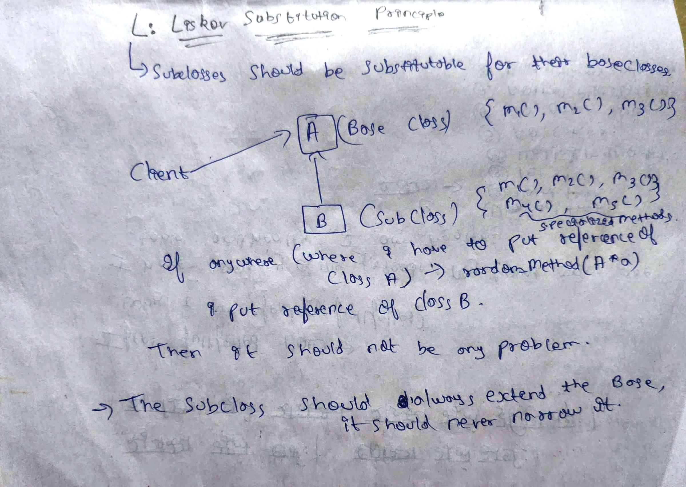

# Liskov Substitution Principle (LSP)

**Liskov Substitution Principle (LSP)** states:

> If S is a subtype of T, then objects of type T should be replaceable  
> with objects of type S **without breaking the correctness of the program**.

In simpler terms:
**A child class should be usable anywhere its parent class is expected,
without surprising behavior.**

---


## Conceptual Overview



LSP is not just about inheritance.
It is about **behavioral contracts** between base classes and their subtypes.

---

## Problem Context

Consider a banking system with an abstract `Account` class.

Different types of accounts exist:
- **Savings Account**
- **Current Account**
- **Fixed Deposit Account**

All accounts allow **deposit** operations.  
However, **not all accounts allow withdrawals**.

---

## ❌ LSP Violation

Initially, the design defines a single abstract class:

- **Account**
  - `deposit()`
  - `withdraw()`

### Concrete implementations

- **SavingsAccount**
  - Supports deposit and withdraw
- **CurrentAccount**
  - Supports deposit and withdraw
- **FixedDepositAccount**
  - Supports deposit
  - ❌ Throws an exception in `withdraw()`

### Why this violates LSP

The client code expects:
> “Any `Account` can safely call `withdraw()`.”

But when a `FixedDepositAccount` is substituted:
- `withdraw()` throws an unexpected exception
- Client behavior breaks
- Substitutability is violated

📌 The child class **changes the expected behavior** of the parent contract.

---

## ❌ Wrong Attempt to Fix (Common Mistake)

A common but incorrect fix is to add conditional logic in the client:

```java
if (account instanceof FixedDepositAccount) {
    account.deposit();
} else {
    account.deposit();
    account.withdraw();
}

### Why this is bad design

- Client is tightly coupled to concrete classes
- Client must know all account types
- Adding a new account type requires modifying client code
- This violates:
  - **LSP** — substitution is no longer transparent
  - **OCP** — client must be modified for new types

📁 Incorrect LSP handling examples can be found here:

lsp-followed-wrongly/code
lsp-followed-wrongly/diagram


---

## ✅ LSP-Compliant Solution

The correct solution is to redesign the abstraction based on **capabilities**, not inheritance convenience.

Instead of forcing all account types to support withdrawal, we separate responsibilities at the type level.

---

### Step 1: Non-withdrawable abstraction

Introduce a base abstraction that represents accounts which **only support deposit**:

- **NonWithdrawableAccount**
  - `deposit()`

This abstraction represents the *minimum guaranteed behavior*.

---

### Step 2: Withdrawable abstraction

Create a more specific abstraction for accounts that truly support withdrawal:

- **WithdrawableAccount**
  - Extends `NonWithdrawableAccount`
  - Adds `withdraw()`

Only accounts that can safely withdraw money inherit from this type.

---

### Step 3: Concrete implementations

- **SavingsAccount**
  - Extends `WithdrawableAccount`
  - Supports both deposit and withdraw

- **CurrentAccount**
  - Extends `WithdrawableAccount`
  - Supports both deposit and withdraw

- **FixedDepositAccount**
  - Extends `NonWithdrawableAccount`
  - Supports deposit only
  - Does not expose `withdraw()`

---

### Why this design follows LSP

- No subclass throws unexpected exceptions
- Client code only depends on the capabilities it needs
- Substitution works safely at compile time
- Invalid operations are prevented by the type system

📁 Correct LSP-compliant examples can be found here:

solution/code
solution/diagram


---

## Key Takeaway

> LSP is not about inheritance hierarchies —  
> it is about **behavioral correctness and substitutability**.

If a subclass cannot honor the full contract of its parent:
- the abstraction is wrong
- the hierarchy must be redesigned

---

## When to Apply LSP Thinking

You should question your design when:

- Subclasses throw unexpected exceptions
- Client code uses `instanceof`
- Methods are overridden to “do nothing”
- Base classes define operations that some children cannot support

These are strong indicators of an **LSP violation**.
